```python
"""import the libraries required"""
import pandas as pd
import string
import matplotlib.pyplot as plt
import numpy as np
```


```python
"""Meta Data"""
"""Define Categories of the Data"""
cat_type_yes_no_h = pd.CategoricalDtype(categories=["हाँ", "नहीं"], ordered=False)
cat_type_eco_status = pd.CategoricalDtype(categories=["BPL", "APL"], ordered=False)
cat_type_sub_cat = pd.CategoricalDtype(categories=["Small & Marginal Farmers", 
                                                   "Other",
                                                  "GENERAL",
                                                  "ST",
                                                  "SC",
                                                  "Landless with homestead",
                                                   "Women Headed HH",
                                                   "PH"], ordered=False)
cat_type_toilet_type_h = pd.CategoricalDtype(categories=["दो गड्ढे वाला",
                                                       "सेप्टिक टैंक",
                                                       "एक गड्ढे वाला",
                                                       "उपलब्ध नहीं है",
                                                       "सोखते गड्ढे के साथ सेप्टिक टैंक",
                                                       "बायो-शौचालय"], ordered=False)
cat_type_water_source_type_h = pd.CategoricalDtype(categories=["हैंडपंप",
                                                         "कुआँ",
                                                         "नल-जल",
                                                         "उपलब्ध नहीं है",
                                                         "पानी का कोई स्त्रोत नहीं",
                                                         "तालाब"], ordered=False)
```


```python
"""Define the columns (if file does not have header row)"""
col_names = ["District",
             "Janpad",
             "Gram Panchayat",
             "Village",
             "Name of head of household",
             "GOI ID", 
             "Column_1", 
             "Economic status",
             "Sub-category",
             "Has Toilet",
             "Type of toilet",
             "Has Water Source",
             "Water source"]
```


```python
"""Define the data types for the columns"""
col_types =                           {"District":'category',
                                      "Janpad":'category',
                                      "Gram Panchayat":'category', 
                                      "Village":'category', 
                                      "Name of head of household":str, 
                                      "GOI ID":str, 
                                      "Column_1":str, 
                                      "Economic status":cat_type_eco_status, 
                                      "Sub-category":cat_type_sub_cat,
                                      "Has Toilet":cat_type_yes_no_h,
                                      "Type of toilet":cat_type_toilet_type_h,
                                      "Has Water Source":cat_type_yes_no_h,
                                      "Water source":cat_type_water_source_type_h}
```


```python
"Read the CSV File as a dataframe"
raw_data = pd.read_csv("D:\\My Freelancing Projects\\Water Aid\\Jal Shakti Charitable Foundation - Data Cleaning and Analysis\\Data Playground\\MP Gov\\verification_data.csv",
                               header=None,
                               names=col_names,
                               dtype=col_types,
                               index_col=False)
```

# Section 1: Information about the file - 

1. Total records (RangeIndex)
2. Number of Columns (Data Columns)
3. Column Names and Data Type


```python
"""Check the file information"""
raw_data.info()
```

    <class 'pandas.core.frame.DataFrame'>
    RangeIndex: 8831779 entries, 0 to 8831778
    Data columns (total 13 columns):
    District                     category
    Janpad                       category
    Gram Panchayat               category
    Village                      category
    Name of head of household    object
    GOI ID                       object
    Column_1                     object
    Economic status              category
    Sub-category                 category
    Has Toilet                   category
    Type of toilet               category
    Has Water Source             category
    Water source                 category
    dtypes: category(10), object(3)
    memory usage: 330.8+ MB
    

# Section 2: Snapshot of the data - 
1. Count - Total number of items in each column
2. Unique - Total number of Unique Items. E.g. Unique count for District = 51 implies that data from 51 districts
3. Top* - Most frequent value
4. Frequency* - Number of times the most frequent value has appeared 

*Not relevant for analysis here


```python
"""Description about the data"""
raw_data.describe()
```


<div>
<style scoped>
    .dataframe tbody tr th:only-of-type {
        vertical-align: middle;
    }

    .dataframe tbody tr th {
        vertical-align: top;
    }

    .dataframe thead th {
        text-align: right;
    }
</style>
<table border="1" class="dataframe">
  <thead>
    <tr style="text-align: right;">
      <th></th>
      <th>District</th>
      <th>Janpad</th>
      <th>Gram Panchayat</th>
      <th>Village</th>
      <th>Name of head of household</th>
      <th>GOI ID</th>
      <th>Column_1</th>
      <th>Economic status</th>
      <th>Sub-category</th>
      <th>Has Toilet</th>
      <th>Type of toilet</th>
      <th>Has Water Source</th>
      <th>Water source</th>
    </tr>
  </thead>
  <tbody>
    <tr>
      <th>count</th>
      <td>8831779</td>
      <td>8831779</td>
      <td>8831779</td>
      <td>8831779</td>
      <td>8831779</td>
      <td>8831779</td>
      <td>0.0</td>
      <td>8831779</td>
      <td>8831779</td>
      <td>8831779</td>
      <td>8831779</td>
      <td>8831779</td>
      <td>8831779</td>
    </tr>
    <tr>
      <th>unique</th>
      <td>51</td>
      <td>311</td>
      <td>19494</td>
      <td>37976</td>
      <td>3791228</td>
      <td>8763390</td>
      <td>0.0</td>
      <td>2</td>
      <td>8</td>
      <td>2</td>
      <td>6</td>
      <td>2</td>
      <td>6</td>
    </tr>
    <tr>
      <th>top</th>
      <td>REWA</td>
      <td>BURHANPUR</td>
      <td>DEORI</td>
      <td>Pipariya</td>
      <td>Ram Singh</td>
      <td>192984102</td>
      <td>NaN</td>
      <td>BPL</td>
      <td>ST</td>
      <td>हाँ</td>
      <td>एक गड्ढे वाला</td>
      <td>हाँ</td>
      <td>हैंडपंप</td>
    </tr>
    <tr>
      <th>freq</th>
      <td>348769</td>
      <td>72138</td>
      <td>9264</td>
      <td>12369</td>
      <td>8643</td>
      <td>52</td>
      <td>NaN</td>
      <td>4479838</td>
      <td>2203392</td>
      <td>8376583</td>
      <td>3758955</td>
      <td>7839744</td>
      <td>4613804</td>
    </tr>
  </tbody>
</table>
</div>


```python
raw_data.shape
```


    (8831779, 13)


## Does the data contain any empty cell?
    True - Yes
    False - No


```python
raw_data.empty
```


    False


```python
"""Capitalize the Name of Districts"""
raw_data["District"] = raw_data["District"].str.upper()

"""Capitalize the Name of Janpad"""
raw_data["Janpad"] = raw_data["Janpad"].str.upper()

"""Capitalize the Name of Gram Panchayat"""
raw_data["Gram Panchayat"] = raw_data["Gram Panchayat"].str.upper()

"""Capitalize the Name of Village"""
raw_data["Village"] = raw_data["Village"].str.upper()

"""Capitalize the Name of Head of Household"""
raw_data["Name of head of household"] = raw_data["Name of head of household"].str.upper()
```


```python
raw_data.head()
```


<div>
<style scoped>
    .dataframe tbody tr th:only-of-type {
        vertical-align: middle;
    }

    .dataframe tbody tr th {
        vertical-align: top;
    }

    .dataframe thead th {
        text-align: right;
    }
</style>
<table border="1" class="dataframe">
  <thead>
    <tr style="text-align: right;">
      <th></th>
      <th>District</th>
      <th>Janpad</th>
      <th>Gram Panchayat</th>
      <th>Village</th>
      <th>Name of head of household</th>
      <th>GOI ID</th>
      <th>Column_1</th>
      <th>Economic status</th>
      <th>Sub-category</th>
      <th>Has Toilet</th>
      <th>Type of toilet</th>
      <th>Has Water Source</th>
      <th>Water source</th>
    </tr>
  </thead>
  <tbody>
    <tr>
      <th>0</th>
      <td>ALIRAJPUR</td>
      <td>ALIRAJPUR</td>
      <td>GARATH</td>
      <td>GARATH</td>
      <td>RICHU</td>
      <td>49823522</td>
      <td>NaN</td>
      <td>APL</td>
      <td>ST</td>
      <td>हाँ</td>
      <td>एक गड्ढे वाला</td>
      <td>हाँ</td>
      <td>हैंडपंप</td>
    </tr>
    <tr>
      <th>1</th>
      <td>NARSINGHPUR</td>
      <td>GOTEGAON (SHRIDHAM)</td>
      <td>BARONDA</td>
      <td>BARODA</td>
      <td>KHEERSAGAR</td>
      <td>50249690</td>
      <td>NaN</td>
      <td>BPL</td>
      <td>GENERAL</td>
      <td>हाँ</td>
      <td>दो गड्ढे वाला</td>
      <td>हाँ</td>
      <td>हैंडपंप</td>
    </tr>
    <tr>
      <th>2</th>
      <td>CHHINDWARA</td>
      <td>MOHKHED</td>
      <td>MAU</td>
      <td>MAU</td>
      <td>GUKAB</td>
      <td>50272567</td>
      <td>NaN</td>
      <td>APL</td>
      <td>Small &amp; Marginal Farmers</td>
      <td>हाँ</td>
      <td>सेप्टिक टैंक</td>
      <td>हाँ</td>
      <td>नल-जल</td>
    </tr>
    <tr>
      <th>3</th>
      <td>SHAJAPUR</td>
      <td>SHUJALPUR</td>
      <td>LAHARKHEDA</td>
      <td>LAHARKHEDA</td>
      <td>MOTILAL</td>
      <td>50966288</td>
      <td>NaN</td>
      <td>BPL</td>
      <td>SC</td>
      <td>हाँ</td>
      <td>दो गड्ढे वाला</td>
      <td>हाँ</td>
      <td>कुआँ</td>
    </tr>
    <tr>
      <th>4</th>
      <td>CHHINDWARA</td>
      <td>MOHKHED</td>
      <td>MAU</td>
      <td>MAU</td>
      <td>NAMDEV</td>
      <td>3315266</td>
      <td>NaN</td>
      <td>APL</td>
      <td>Small &amp; Marginal Farmers</td>
      <td>हाँ</td>
      <td>दो गड्ढे वाला</td>
      <td>हाँ</td>
      <td>नल-जल</td>
    </tr>
  </tbody>
</table>
</div>


## Identify duplicate records 
Based on the combination - District+Janpad+Gram Panchayat+Village+Name of head of household+GOI ID 


```python
raw_data["is_duplicate_record"] = raw_data.duplicated(subset=("District",
             "Janpad",
             "Gram Panchayat",
             "Village",
             "Name of head of household",
             "GOI ID"))
```

# Section 3: Data Error Checks

## 1. Total Duplicate records:


```python
"""Data Error Condition 1: Number of Duplicate Records identified using Duplicate Key above"""
raw_data[raw_data["is_duplicate_record"] == True].shape[0]
```


    65222


## 2. Missing Data in Mandatory Columns:


```python
"""Data Error Condition 2: Check Missing Data in the mandatory columns""" 
for label, content in raw_data.items():
    """Apply the condition in all columns except"""
    if label not in ["District",
             "Janpad",
             "Gram Panchayat",
             "Village",
             "Name of head of household",
             "GOI ID",
             "is_duplicate_record"]:
        print("-----")
        print(content.value_counts())
        if content.isna().any():
            print("Missing Data: ",content.isna().shape[0])
        else:
            print("Missing Data: ",0)
```

    -----
    Series([], Name: Column_1, dtype: int64)
    Missing Data:  8831779
    -----
    BPL    4479838
    APL    4351941
    Name: Economic status, dtype: int64
    Missing Data:  0
    -----
    ST                          2203392
    GENERAL                     2096241
    Other                       2003471
    SC                          1319150
    Small & Marginal Farmers     902280
    Women Headed HH              205095
    Landless with homestead       75243
    PH                            26907
    Name: Sub-category, dtype: int64
    Missing Data:  0
    -----
    हाँ     8376583
    नहीं     455196
    Name: Has Toilet, dtype: int64
    Missing Data:  0
    -----
    एक गड्ढे वाला                      3758955
    दो गड्ढे वाला                      2654578
    सेप्टिक टैंक                       1599267
    उपलब्ध नहीं है                      460537
    सोखते गड्ढे के साथ सेप्टिक टैंक     345209
    बायो-शौचालय                          13233
    Name: Type of toilet, dtype: int64
    Missing Data:  0
    -----
    हाँ     7839744
    नहीं     992035
    Name: Has Water Source, dtype: int64
    Missing Data:  0
    -----
    हैंडपंप                     4613804
    नल-जल                       2381578
    कुआँ                        1281467
    पानी का कोई स्त्रोत नहीं     367138
    उपलब्ध नहीं है               149994
    तालाब                         37798
    Name: Water source, dtype: int64
    Missing Data:  0
    

### Observations: 
a. All the values in Column_1 are missing.
b. There is no other missing value error.

## 3. Number of records where toilet is available in the household but type of toilet has either not been provided or mentioned as not available - 


```python
"""Data Error Condition 3: Number of Records where toilet is available but type of toilet has been mentioned उपलब्ध नहीं है"""
raw_data[(raw_data["Has Toilet"] == 'हाँ') & (raw_data["Type of toilet"] == 'उपलब्ध नहीं है')].shape[0]
```


    8833


## 4. Number of records where toilet is not available in the household but type of toilet has been mentioned - 


```python
"""Data Error Condition 4: Number of Records where toilet is not available but type of toilet has been mentioned other than उपलब्ध नहीं है"""
raw_data[(raw_data["Has Toilet"] == 'नहीं') & (raw_data["Type of toilet"] != 'उपलब्ध नहीं है')].shape[0]
```


    3492


## 5. Number of records where water source is available in the household but type of source has either not been provided or mentioned as not available - 


```python
"""Data Error Condition 3: Number of Records where water source is available but type of source has been mentioned as not available"""
raw_data[(raw_data["Has Water Source"] == 'हाँ') & ((raw_data["Water source"] == 'उपलब्ध नहीं है') | (raw_data["Water source"] == 'पानी का कोई स्त्रोत नहीं'))].shape[0]
```


    322910


## 6. Number of records where water source is  not available in the household but type of source has been provided - 


```python
"""Data Error Condition 3: Number of Records where water source is not available but type of source has been mentioned as available"""
raw_data[(raw_data["Has Water Source"] == 'नहीं') & (raw_data["Water source"] != 'उपलब्ध नहीं है') & (raw_data["Water source"] != 'पानी का कोई स्त्रोत नहीं')].shape[0]
```


    797813


# Section 2: Data Analysis

## 1. Overview

### Total Households Surveyed in Reverification of Toilet:


```python
raw_data.shape[0]
```


    8831779


```python
plt.figure()
```


    <Figure size 432x288 with 0 Axes>


    <Figure size 432x288 with 0 Axes>


### Households by Economic Status


```python
print("Number of households in")
print("-----------------------")
hh_by_eco_status_cnt = raw_data["Economic status"].value_counts()
print(hh_by_eco_status_cnt)
print("-----------------------")
print("% of households in")
print("-----------------------")
hh_by_eco_status_pct = raw_data["Economic status"].value_counts(normalize=True)*100
print(hh_by_eco_status_pct)
print("-----------------------")
hh_by_eco_status_pct.plot.pie(figsize=[8,4.5], 
                          title="Distribution of Households by Economic Status",
                          legend=True)
```

    Number of households in
    -----------------------
    BPL    4479838
    APL    4351941
    Name: Economic status, dtype: int64
    -----------------------
    % of households in
    -----------------------
    BPL    50.724073
    APL    49.275927
    Name: Economic status, dtype: float64
    -----------------------
    


    <matplotlib.axes._subplots.AxesSubplot at 0x2863f0192b0>


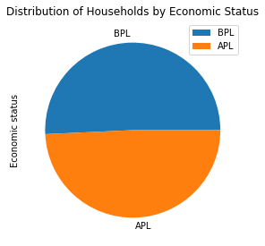


#### Observations:
1. Distribution of households by economic status is quite even, i.e. there are almost 50% BPL and 50% APL families where verification of toilet has been conducted.

### Households by Social Category


```python
print("Number of households in")
print("-----------------------")
hh_by_sco_catgry_cnt = raw_data["Sub-category"].value_counts()
print(hh_by_sco_catgry_cnt)
print("-----------------------")
print("% of households in")
print("-----------------------")
hh_by_sco_catgry_pct = raw_data["Sub-category"].value_counts(normalize=True)*100
print(hh_by_sco_catgry_pct)
print("-----------------------")
hh_by_sco_catgry_pct.plot.barh(figsize=[10.66,6], 
                          title="Distribution of Households by Economic Status",
                          legend=True)
```

    Number of households in
    -----------------------
    ST                          2203392
    GENERAL                     2096241
    Other                       2003471
    SC                          1319150
    Small & Marginal Farmers     902280
    Women Headed HH              205095
    Landless with homestead       75243
    PH                            26907
    Name: Sub-category, dtype: int64
    -----------------------
    % of households in
    -----------------------
    ST                          24.948450
    GENERAL                     23.735207
    Other                       22.684795
    SC                          14.936402
    Small & Marginal Farmers    10.216288
    Women Headed HH              2.322239
    Landless with homestead      0.851957
    PH                           0.304661
    Name: Sub-category, dtype: float64
    -----------------------
    


    <matplotlib.axes._subplots.AxesSubplot at 0x28638edb630>


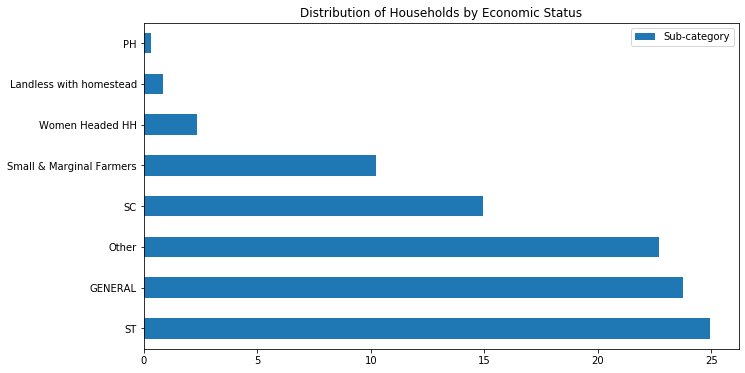


### Households by Economic Status and Social Category


```python
pd.crosstab(index=raw_data["Economic status"], 
                          columns=raw_data["Sub-category"]).plot.bar(figsize=[16,9],
                                                                    title="Number of households in different social categories and economic status",
                                                                    table=False)
```


    <matplotlib.axes._subplots.AxesSubplot at 0x28650480518>


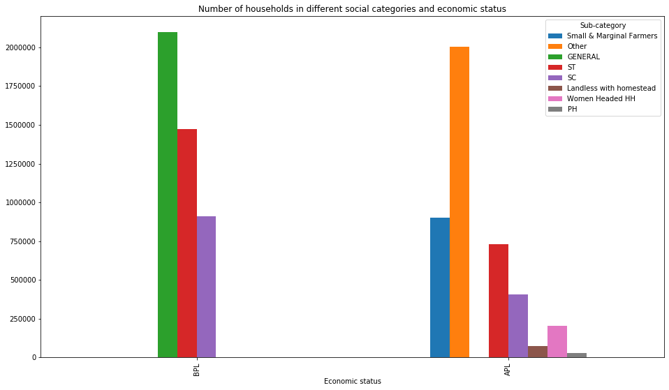


#### Observations - 
1. There are 22.7% households in "Others" category
2. All the General category households are BPL
3. BPL Households has only General,  SC and ST category. No landless family, or household headed by a woman or physically challenged person has been reported as BPL.

## 2. Status of Toilets in Households

### Availability of Toilets in the Households


```python
print("Number of households having toilet")
print("-----------------------")
hh_hvng_tlt_cnt = raw_data["Has Toilet"].value_counts()
print(hh_hvng_tlt_cnt)
print("-----------------------")
print("% of households haing toilet")
print("-----------------------")
hh_hvng_tlt_pct = raw_data["Has Toilet"].value_counts(normalize=True)*100
print(hh_hvng_tlt_pct)
print("-----------------------")
```

    Number of households having toilet
    -----------------------
    हाँ     8376583
    नहीं     455196
    Name: Has Toilet, dtype: int64
    -----------------------
    % of households haing toilet
    -----------------------
    हाँ     94.845931
    नहीं     5.154069
    Name: Has Toilet, dtype: float64
    -----------------------
    


```python
plt.rcParams['font.family']='Nirmala UI'

hh_hvng_tlt_pct.plot.pie(figsize=[8,4.5], 
                          title="Status of Toilets in Households",
                          legend=True)
```


    <matplotlib.axes._subplots.AxesSubplot at 0x286080ba710>


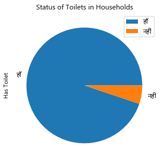


```python
pd.crosstab(index=raw_data["Economic status"], 
                          columns=raw_data["Has Toilet"]).plot.barh(figsize=[8,4.5],
                                                                    title="Status of toilets in households in different economic status",
                                                                    table=False)
```


    <matplotlib.axes._subplots.AxesSubplot at 0x28679c1d4e0>


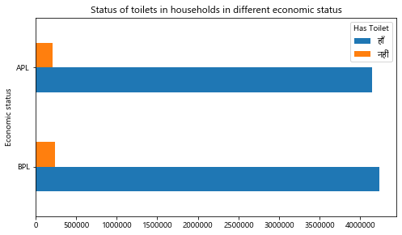


```python
pd.crosstab(index=raw_data["Has Toilet"], 
                          columns=raw_data["Sub-category"]).plot.barh(figsize=[10,4.5],
                                                                    title="Status of toilets in households in different social categories",
                                                                    table=False)
```


    <matplotlib.axes._subplots.AxesSubplot at 0x2867109cf60>


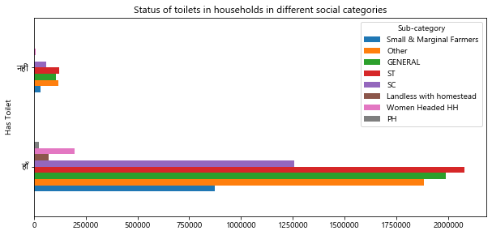


#### Observations:
1. 94.85% of the housheolds have toilet
2. However 4.55 lakh households are still devoid of toilet facility. ST households are the most affected

### Availabilty of Different Types of Toilet across Households


```python
hh_with_toilet = raw_data[(raw_data["Has Toilet"] == 'हाँ') & (raw_data["Type of toilet"] != 'उपलब्ध नहीं है')]
```


```python
print("Number of households having different types toilet")
print("--------------------------------------------------")
hh_hvng_tlt_type_cnt = hh_with_toilet["Type of toilet"].value_counts()
print(hh_hvng_tlt_type_cnt)
print("--------------------------------------------------")
print("% of households haing different types of toilet")
print("--------------------------------------------------")
hh_hvng_tlt_type_pct = hh_with_toilet["Type of toilet"].value_counts(normalize=True)*100
print(hh_hvng_tlt_type_pct)
print("--------------------------------------------------")
```

    Number of households having different types toilet
    --------------------------------------------------
    एक गड्ढे वाला                      3756730
    दो गड्ढे वाला                      2654140
    सेप्टिक टैंक                       1598559
    सोखते गड्ढे के साथ सेप्टिक टैंक     345090
    बायो-शौचालय                          13231
    उपलब्ध नहीं है                           0
    Name: Type of toilet, dtype: int64
    --------------------------------------------------
    % of households haing different types of toilet
    --------------------------------------------------
    एक गड्ढे वाला                      44.895342
    दो गड्ढे वाला                      31.718682
    सेप्टिक टैंक                       19.103809
    सोखते गड्ढे के साथ सेप्टिक टैंक     4.124048
    बायो-शौचालय                         0.158119
    उपलब्ध नहीं है                      0.000000
    Name: Type of toilet, dtype: float64
    --------------------------------------------------
    


```python
hh_hvng_tlt_type_pct.plot.pie(figsize=[10,7], 
                          title="% of Households having different Types of Toilets",
                          legend=True)
```


    <matplotlib.axes._subplots.AxesSubplot at 0x2866723d9e8>


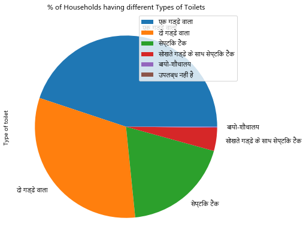


## 3. Status of Water Sources in the Households

### Availability of Water Source in the Households


```python
print("Number of households having water source")
print("-----------------------")
hh_hvng_wtr_src_cnt = raw_data["Has Water Source"].value_counts()
print(hh_hvng_wtr_src_cnt)
print("-----------------------")
print("% of households haing water source")
print("-----------------------")
hh_hvng_wtr_src_pct = raw_data["Has Water Source"].value_counts(normalize=True)*100
print(hh_hvng_wtr_src_pct)
print("-----------------------")
```

    Number of households having water source
    -----------------------
    हाँ     7839744
    नहीं     992035
    Name: Has Water Source, dtype: int64
    -----------------------
    % of households haing water source
    -----------------------
    हाँ     88.767439
    नहीं    11.232561
    Name: Has Water Source, dtype: float64
    -----------------------
    


```python
hh_hvng_wtr_src_pct.plot.pie(figsize=[8,4.5], 
                          title="Availability of Water Source in Households",
                          legend=True)
```


    <matplotlib.axes._subplots.AxesSubplot at 0x28650495208>


```python
pd.crosstab(index=raw_data["Economic status"], 
                          columns=raw_data["Has Water Source"]).plot.barh(figsize=[8,4.5],
                                                                    title="Availability of Water Source in households of different economic status",
                                                                    table=False)
```


    <matplotlib.axes._subplots.AxesSubplot at 0x2862c35b780>


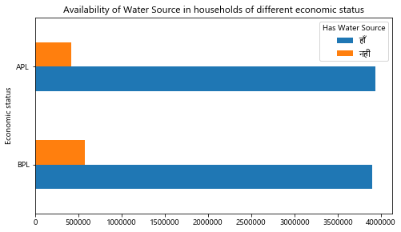


```python
pd.crosstab(index=raw_data["Has Water Source"], 
                          columns=raw_data["Sub-category"]).plot.barh(figsize=[10,6],
                                                                    title="Availability of Water Source in households of different social categories",
                                                                    table=False)
```


    <matplotlib.axes._subplots.AxesSubplot at 0x2863d000f60>


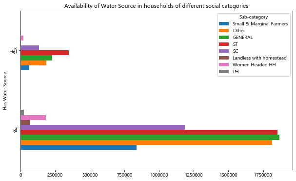


#### Observation:
1. 88.77% of the households have a water source
2. Howerver, around 9.9 Lakh Households don't have water source. ST category households are the worst affected.

### Availabilty of Different Types of Water Sources across Households


```python
hh_with_wtr_src = raw_data[(raw_data["Has Water Source"] == 'हाँ') & (raw_data["Water source"] != 'उपलब्ध नहीं है') & (raw_data["Water source"] != 'पानी का कोई स्त्रोत नहीं')]
```


```python
print("Number of households having different types of water source")
print("--------------------------------------------------")
hh_hvng_wtr_src_type_cnt = hh_with_wtr_src["Water source"].value_counts()
print(hh_hvng_wtr_src_type_cnt)
print("--------------------------------------------------")
print("% of households haing different types of water source")
print("--------------------------------------------------")
hh_hvng_wtr_src_type_pct = hh_with_wtr_src["Water source"].value_counts(normalize=True)*100
print(hh_hvng_wtr_src_type_pct)
print("--------------------------------------------------")
```

    Number of households having different types of water source
    --------------------------------------------------
    हैंडपंप                     4154364
    नल-जल                       2232978
    कुआँ                        1098231
    तालाब                         31261
    पानी का कोई स्त्रोत नहीं          0
    उपलब्ध नहीं है                    0
    Name: Water source, dtype: int64
    --------------------------------------------------
    % of households haing different types of water source
    --------------------------------------------------
    हैंडपंप                     55.267470
    नल-जल                       29.706363
    कुआँ                        14.610287
    तालाब                        0.415880
    पानी का कोई स्त्रोत नहीं     0.000000
    उपलब्ध नहीं है               0.000000
    Name: Water source, dtype: float64
    --------------------------------------------------
    


```python
hh_hvng_wtr_src_type_pct.plot.pie(figsize=[10,7], 
                          title="% of Households having different Types of Water Sources",
                          legend=True)
```


    <matplotlib.axes._subplots.AxesSubplot at 0x28622760320>


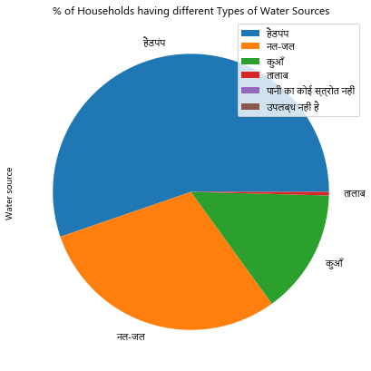


### Availability of Toilets and Water Source in the Households


```python
hh_tlt_n_wtr_src_cnt = pd.crosstab(index=raw_data["Has Water Source"], columns=raw_data["Has Toilet"])
print(hh_tlt_n_wtr_src_cnt)
hh_tlt_n_wtr_src_cnt.plot.barh(figsize=[10,6],
                               title="Availability of Water Source in households of different social categories",
                               table=False)
```

    Has Toilet            हाँ    नहीं
    Has Water Source                 
    हाँ               7820538   19206
    नहीं               556045  435990
    


    <matplotlib.axes._subplots.AxesSubplot at 0x28639a547f0>


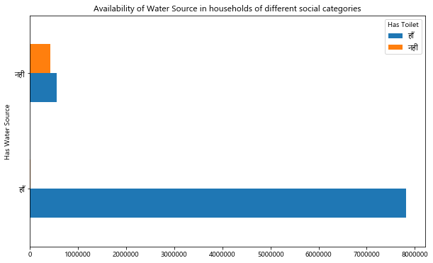


#### Observation:
1. Handpump is the major source of water in households (55% of households use handpumps)
2. Water Supply scheme is available in only 29.7% ~ 30% of the households and the remaining.
3. 14% of the households rely on wells
4. Around 5.56 Lakh households having toilets has no water source

# Section 3: Status of toilets across State and Districts


```python
raw_data['State']= "Madhya Pradesh"
```


```python
raw_data['% Headed by Women'] = raw_data['Sub-category'].apply(lambda x: 100 if (x=="Women Headed HH") else 0)
```


```python
raw_data['% Headed by PH'] = raw_data['Sub-category'].apply(lambda x: 100 if (x=="PH") else 0)
```


```python
raw_data['% Having No Toilet'] = pd.to_numeric(raw_data['Has Toilet'].apply(lambda x: 100 if (x=="नहीं") else 0))
```


```python
raw_data['% Having No Water Source'] = pd.to_numeric(raw_data['Has Water Source'].apply(lambda x: 100 if (x=="नहीं") else 0))
```


```python
raw_data['Total Household'] = 1
```


```python
raw_data['% Households having Toilet but no Water Source'] = np.where((raw_data['Has Toilet']=="हाँ") & (raw_data['Has Water Source']=='नहीं'),100,0)
```


```python
raw_data.pivot_table(index=['State','District'], 
                     values=['Total Household', 
                             '% Headed by Women', 
                             '% Headed by PH', 
                             '% Having No Toilet', 
                             '% Having No Water Source',
                            '% Households having Toilet but no Water Source'],
                     aggfunc={'Total Household':np.sum, 
                              '% Headed by Women':np.mean, 
                              '% Headed by PH':np.mean, 
                              '% Having No Toilet':np.mean, 
                              '% Having No Water Source':np.mean,
                             '% Households having Toilet but no Water Source':np.mean},
                    margins=True)
```


<div>
<style scoped>
    .dataframe tbody tr th:only-of-type {
        vertical-align: middle;
    }

    .dataframe tbody tr th {
        vertical-align: top;
    }

    .dataframe thead th {
        text-align: right;
    }
</style>
<table border="1" class="dataframe">
  <thead>
    <tr style="text-align: right;">
      <th></th>
      <th></th>
      <th>% Having No Toilet</th>
      <th>% Having No Water Source</th>
      <th>% Headed by PH</th>
      <th>% Headed by Women</th>
      <th>% Households having Toilet but no Water Source</th>
      <th>Total Household</th>
    </tr>
    <tr>
      <th>State</th>
      <th>District</th>
      <th></th>
      <th></th>
      <th></th>
      <th></th>
      <th></th>
      <th></th>
    </tr>
  </thead>
  <tbody>
    <tr>
      <th rowspan="51" valign="top">Madhya Pradesh</th>
      <th>AGAR MALWA</th>
      <td>3.833214</td>
      <td>6.150549</td>
      <td>0.146782</td>
      <td>1.345717</td>
      <td>2.881081</td>
      <td>76985</td>
    </tr>
    <tr>
      <th>ALIRAJPUR</th>
      <td>0.953950</td>
      <td>3.419390</td>
      <td>0.150142</td>
      <td>2.112973</td>
      <td>2.626568</td>
      <td>109230</td>
    </tr>
    <tr>
      <th>ANUPPUR</th>
      <td>3.615544</td>
      <td>21.898702</td>
      <td>0.325928</td>
      <td>4.355816</td>
      <td>18.368108</td>
      <td>115363</td>
    </tr>
    <tr>
      <th>ASHOKNAGAR</th>
      <td>1.028340</td>
      <td>4.421422</td>
      <td>0.285041</td>
      <td>1.732171</td>
      <td>3.450090</td>
      <td>91215</td>
    </tr>
    <tr>
      <th>BALAGHAT</th>
      <td>6.258527</td>
      <td>12.600819</td>
      <td>0.153263</td>
      <td>1.851953</td>
      <td>6.665277</td>
      <td>273387</td>
    </tr>
    <tr>
      <th>BARWANI</th>
      <td>9.419350</td>
      <td>17.138339</td>
      <td>0.062358</td>
      <td>0.917549</td>
      <td>7.968420</td>
      <td>179609</td>
    </tr>
    <tr>
      <th>BETUL</th>
      <td>3.776404</td>
      <td>8.786625</td>
      <td>0.283754</td>
      <td>3.003504</td>
      <td>5.172783</td>
      <td>205460</td>
    </tr>
    <tr>
      <th>BHIND</th>
      <td>2.586091</td>
      <td>3.218545</td>
      <td>0.344684</td>
      <td>3.668106</td>
      <td>0.867146</td>
      <td>156375</td>
    </tr>
    <tr>
      <th>BHOPAL</th>
      <td>1.849356</td>
      <td>3.531161</td>
      <td>0.294788</td>
      <td>1.473941</td>
      <td>1.720858</td>
      <td>79379</td>
    </tr>
    <tr>
      <th>BURHANPUR</th>
      <td>4.769387</td>
      <td>10.227891</td>
      <td>0.069351</td>
      <td>1.119265</td>
      <td>5.545411</td>
      <td>113914</td>
    </tr>
    <tr>
      <th>CHHATARPUR</th>
      <td>9.499232</td>
      <td>20.025465</td>
      <td>0.485616</td>
      <td>3.227792</td>
      <td>11.014479</td>
      <td>190068</td>
    </tr>
    <tr>
      <th>CHHINDWARA</th>
      <td>1.798628</td>
      <td>5.060058</td>
      <td>0.449114</td>
      <td>3.148453</td>
      <td>3.327850</td>
      <td>322190</td>
    </tr>
    <tr>
      <th>DAMOH</th>
      <td>7.731420</td>
      <td>18.816605</td>
      <td>0.319406</td>
      <td>2.642315</td>
      <td>11.237923</td>
      <td>200998</td>
    </tr>
    <tr>
      <th>DATIA</th>
      <td>4.531905</td>
      <td>5.863504</td>
      <td>0.216680</td>
      <td>2.178623</td>
      <td>1.567979</td>
      <td>76149</td>
    </tr>
    <tr>
      <th>DEWAS</th>
      <td>4.204655</td>
      <td>6.218983</td>
      <td>0.207233</td>
      <td>2.097618</td>
      <td>2.254282</td>
      <td>201705</td>
    </tr>
    <tr>
      <th>DHAR</th>
      <td>0.981030</td>
      <td>2.619847</td>
      <td>0.171552</td>
      <td>2.000068</td>
      <td>1.700452</td>
      <td>292040</td>
    </tr>
    <tr>
      <th>DINDORI</th>
      <td>7.841088</td>
      <td>20.269864</td>
      <td>0.115012</td>
      <td>2.055176</td>
      <td>12.555063</td>
      <td>133030</td>
    </tr>
    <tr>
      <th>GUNA</th>
      <td>7.025674</td>
      <td>16.065921</td>
      <td>0.206375</td>
      <td>1.633115</td>
      <td>9.229485</td>
      <td>134222</td>
    </tr>
    <tr>
      <th>GWALIOR</th>
      <td>1.218779</td>
      <td>1.913615</td>
      <td>0.234742</td>
      <td>2.025352</td>
      <td>0.984977</td>
      <td>106500</td>
    </tr>
    <tr>
      <th>HARDA</th>
      <td>1.936637</td>
      <td>5.483277</td>
      <td>0.093797</td>
      <td>0.577129</td>
      <td>3.631609</td>
      <td>90621</td>
    </tr>
    <tr>
      <th>HOSHANGABAD</th>
      <td>2.428676</td>
      <td>5.937459</td>
      <td>0.240302</td>
      <td>1.355453</td>
      <td>3.638946</td>
      <td>159799</td>
    </tr>
    <tr>
      <th>INDORE</th>
      <td>0.330745</td>
      <td>0.703235</td>
      <td>0.098902</td>
      <td>1.056458</td>
      <td>0.388545</td>
      <td>155709</td>
    </tr>
    <tr>
      <th>JABALPUR</th>
      <td>23.269883</td>
      <td>33.754946</td>
      <td>0.250033</td>
      <td>2.151911</td>
      <td>11.110688</td>
      <td>183976</td>
    </tr>
    <tr>
      <th>JHABUA</th>
      <td>1.891071</td>
      <td>8.230995</td>
      <td>0.516979</td>
      <td>1.699437</td>
      <td>6.477334</td>
      <td>162289</td>
    </tr>
    <tr>
      <th>KATNI</th>
      <td>4.100503</td>
      <td>11.610048</td>
      <td>0.283093</td>
      <td>2.206169</td>
      <td>7.676038</td>
      <td>184392</td>
    </tr>
    <tr>
      <th>KHANDWA</th>
      <td>3.766577</td>
      <td>6.912098</td>
      <td>0.298149</td>
      <td>2.934547</td>
      <td>3.554056</td>
      <td>193863</td>
    </tr>
    <tr>
      <th>KHARGONE</th>
      <td>9.291793</td>
      <td>17.694603</td>
      <td>0.491337</td>
      <td>3.113383</td>
      <td>8.643297</td>
      <td>231613</td>
    </tr>
    <tr>
      <th>MANDLA</th>
      <td>8.537025</td>
      <td>24.460321</td>
      <td>0.351304</td>
      <td>3.309468</td>
      <td>16.201967</td>
      <td>202389</td>
    </tr>
    <tr>
      <th>MANDSAUR</th>
      <td>2.998116</td>
      <td>6.154085</td>
      <td>0.326941</td>
      <td>2.762676</td>
      <td>3.416558</td>
      <td>186884</td>
    </tr>
    <tr>
      <th>MORENA</th>
      <td>3.182942</td>
      <td>4.502400</td>
      <td>0.384483</td>
      <td>3.224624</td>
      <td>1.475407</td>
      <td>139148</td>
    </tr>
    <tr>
      <th>NARSINGHPUR</th>
      <td>1.229253</td>
      <td>3.658556</td>
      <td>0.348820</td>
      <td>1.363373</td>
      <td>2.495822</td>
      <td>184909</td>
    </tr>
    <tr>
      <th>NEEMUCH</th>
      <td>2.532216</td>
      <td>9.063230</td>
      <td>0.444907</td>
      <td>2.530071</td>
      <td>6.835481</td>
      <td>93278</td>
    </tr>
    <tr>
      <th>PANNA</th>
      <td>5.980607</td>
      <td>12.085364</td>
      <td>0.243306</td>
      <td>1.844413</td>
      <td>6.271717</td>
      <td>140153</td>
    </tr>
    <tr>
      <th>RAISEN</th>
      <td>3.004990</td>
      <td>5.607133</td>
      <td>0.370128</td>
      <td>1.977935</td>
      <td>3.066337</td>
      <td>195608</td>
    </tr>
    <tr>
      <th>RAJGARH</th>
      <td>7.404013</td>
      <td>14.571635</td>
      <td>0.385230</td>
      <td>2.412360</td>
      <td>7.587873</td>
      <td>171326</td>
    </tr>
    <tr>
      <th>RATLAM</th>
      <td>1.144240</td>
      <td>3.877441</td>
      <td>0.245445</td>
      <td>2.696969</td>
      <td>2.775862</td>
      <td>171118</td>
    </tr>
    <tr>
      <th>REWA</th>
      <td>9.643059</td>
      <td>18.882125</td>
      <td>0.258911</td>
      <td>2.661647</td>
      <td>9.535825</td>
      <td>348769</td>
    </tr>
    <tr>
      <th>SAGAR</th>
      <td>2.100045</td>
      <td>6.451079</td>
      <td>0.260482</td>
      <td>2.386500</td>
      <td>4.454173</td>
      <td>265661</td>
    </tr>
    <tr>
      <th>SATNA</th>
      <td>8.907510</td>
      <td>22.415462</td>
      <td>0.276151</td>
      <td>2.290570</td>
      <td>13.803701</td>
      <td>336772</td>
    </tr>
    <tr>
      <th>SEHORE</th>
      <td>1.255013</td>
      <td>4.216013</td>
      <td>0.322407</td>
      <td>1.163532</td>
      <td>3.048030</td>
      <td>202229</td>
    </tr>
    <tr>
      <th>SEONI</th>
      <td>15.107854</td>
      <td>27.777583</td>
      <td>0.572204</td>
      <td>3.279524</td>
      <td>13.096576</td>
      <td>227716</td>
    </tr>
    <tr>
      <th>SHAHDOL</th>
      <td>1.656705</td>
      <td>7.102718</td>
      <td>0.357419</td>
      <td>2.599234</td>
      <td>5.526763</td>
      <td>151083</td>
    </tr>
    <tr>
      <th>SHAJAPUR</th>
      <td>0.628987</td>
      <td>1.609793</td>
      <td>0.190079</td>
      <td>1.546894</td>
      <td>1.054763</td>
      <td>144677</td>
    </tr>
    <tr>
      <th>SHEOPUR</th>
      <td>1.033273</td>
      <td>1.548867</td>
      <td>0.308938</td>
      <td>2.661462</td>
      <td>0.851668</td>
      <td>95812</td>
    </tr>
    <tr>
      <th>SHIVPURI</th>
      <td>8.493930</td>
      <td>14.273378</td>
      <td>0.290547</td>
      <td>2.562097</td>
      <td>6.000406</td>
      <td>196870</td>
    </tr>
    <tr>
      <th>SIDHI</th>
      <td>4.524185</td>
      <td>13.293284</td>
      <td>0.663423</td>
      <td>3.490263</td>
      <td>8.949694</td>
      <td>161134</td>
    </tr>
    <tr>
      <th>SINGROULI</th>
      <td>4.607921</td>
      <td>19.394490</td>
      <td>0.301342</td>
      <td>2.174123</td>
      <td>14.881063</td>
      <td>134399</td>
    </tr>
    <tr>
      <th>TIKAMGARH</th>
      <td>1.536847</td>
      <td>3.471882</td>
      <td>0.631510</td>
      <td>2.565975</td>
      <td>1.999498</td>
      <td>175294</td>
    </tr>
    <tr>
      <th>UJJAIN</th>
      <td>2.054726</td>
      <td>3.184233</td>
      <td>0.191964</td>
      <td>1.931490</td>
      <td>1.190651</td>
      <td>210977</td>
    </tr>
    <tr>
      <th>UMARIA</th>
      <td>6.991193</td>
      <td>19.559731</td>
      <td>0.111486</td>
      <td>1.303374</td>
      <td>13.031713</td>
      <td>98667</td>
    </tr>
    <tr>
      <th>VIDISHA</th>
      <td>7.955889</td>
      <td>12.889580</td>
      <td>0.436024</td>
      <td>2.209529</td>
      <td>5.360102</td>
      <td>176825</td>
    </tr>
    <tr>
      <th>All</th>
      <th></th>
      <td>5.154069</td>
      <td>11.232561</td>
      <td>0.304661</td>
      <td>2.322239</td>
      <td>6.295957</td>
      <td>8831779</td>
    </tr>
  </tbody>
</table>
</div>


#### Observations
1. In Jabalpur 23.27% of the households do not have toilet, followed by Seoni with 15.1% such households
2. Again, Jabalpur and Seoni are the two districts with highest % of households without any source of water (with 33.75% and 27.78% respectively)
3. Anuppur and Mandala districts have the highest proportion of households having a toilet but no water source (with 18.37% and 16.2% respectively)
